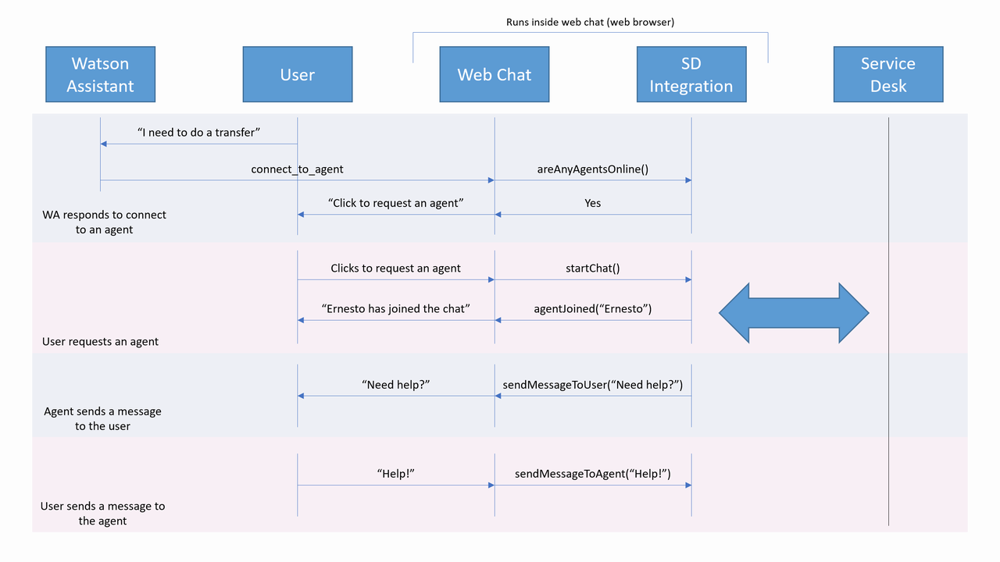

# ServiceDesk API

In order to create a custom service desk integration, you must create a new class or object that implements or
satisfies the [ServiceDesk](../src/common/types/serviceDesk.ts) interface.

There are two basic components to an integration.
1. Implement the `ServiceDesk` interface as noted above. This allows web chat to send messages and instructions to 
   the service desk. This class or object is what you will return from the factory function given to web chat when 
   it creates a new instance of your integration.
2. In your `ServiceDesk` implementation, use the `callback` that was provided to the factory function when it was 
   created. This callback will be used by your integration to send messages and instructions from the service desk 
   back to web chat. Review the [ServiceDeskCallback](../src/common/types/serviceDeskCallback.ts) for more information.

An implementation template can be found in [../src/example/webChat/client/src/serviceDeskTemplate.ts](../src/example/webChat/client/src/serviceDeskTemplate.ts).

## Interaction flow

Below is a list of the steps and actions that typically occur when a user is connected to a service desk and how web chat interacts with the service desk integration.

1. When web chat is started, it will create a single instance of the service desk integration using the `serviceDeskFactory` configuration property.
2. A user sends a message to Watson Assistant and it returns a "Connect to Agent" response (type=`connect_to_agent`).
3. If the service desk integration implements it, web chat will call `areAnyAgentsOnline` to determine if any agents are online. This determines whether web chat displays a "request agent" button or if it shows the "no agents available" message instead.
4. User clicks the "request agent" button.
5. Web chat will call the `startChat` function on the integration. The integration should ask the service desk to start a new chat.
6. A banner is displayed to the user to indicate web chat is connecting them to an agent.
7. If the service desk provides the capability, the integration may call the callback function `updateAgentAvailability` to update the banner letting the user know how long the wait might be.
8. When an agent becomes available, the integration should call `agentJoined` and web chat will inform the user that an agent has joined.
9. When an agent sends a message, the integration should call `sendMessageToUser`.
10. When the user sends a message, web chat will call `sendMessageToAgent`.
11. The user ends the chat.
12. Web chat will call `endChat` on the integration. This will tell the service desk that the chat is over.

We also have a more thorough list of [steps](./STEPS.md) required to create your own integration.

## Agent app

Most service desks have a way to embed a custom iFrame into the agent view, as well as a way to pass metadata into that iFrame. You can use an "agent app" version of web chat to display the user's prior chat history to the agent. When the `startChat` function is called, `startChatOptions.agentAppInfo` contains metadata necessary for this. See [the agent app documentation](./AGENT_APP.md) for more information.
