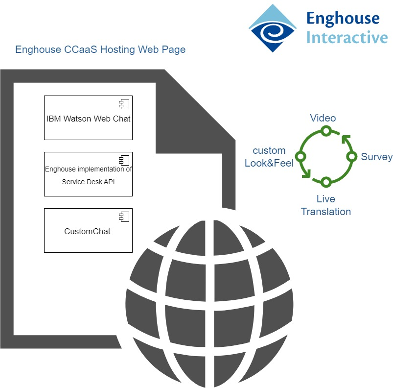

# Enghouse Interactive CCaaS Integration Example

The **Enghouse CCaaS** integration enables integration between IBM Watson Assistant (WA) and Enghouse Interactive (EI) **CCaaS** tenants' live agents.

## Overview

The integration attempts to make it as simple as possible for Watson Assistance users with EI **CCaaS** live agents.

### Architecture

The EI **CCaaS**  integration consists of two main components: hosting web page and backend Contact Center platform . Below is client side componenet Architecture:



The client-side component manages the communication between the user and the agent. It implements the service desk API that is fully supported by the Watson Assistant web chat integration. (For more information about this API, see [ServiceDesk API](https://github.com/watson-developer-cloud/assistant-web-chat-service-desk-starter/blob/main/docs/API.md)).

The communication uses the EI CustomChat widget component.  This can be referenced using the EI **CCaaS** default page or the [hosting page](./client/indexWatson.html) can be managed by the customer - simply add a script tag to load the EnghouseCCaaSWatsonAssistance.js from the EI **CCaaS** servers and pass the parameters to your page in the URL as detailed below. The hosting page may also be modified to set the `watsonAssistantChatOptions` prior to loading the EnghouseCCaaSWatsonAssistance.js for more advanced features, or to set the integration parameters in HTML rather than via URL (if both set URL will override HTML), e.g.:

```
<script>
 configuration
  window.watsonAssistantChatOptions = {
    integrationID: '[integrationID]',
    region: '[region]',
    serviceInstanceID: '[serviceInstanceID]',
    subscriptionID: null,
    debug: true,
    carbonTheme: 'g100'
  };

</script>	
<script src="https://ccsp.ei.eilabonline.biz/PS.CustomChat/EnghouseCCaaSWatsonAssistance.js"></script>
```


## Setting Up


The integration utilises the flexible Custom Chat integration to EI **CCaaS**, the steps for deployment are:


1. Configure Chat routing in EI **CCaaS** tenant with desired Queue and Skills.
2. Configure CustomChat "widget" and copy its URL used to control the Live Agent interaction specific to your needs, and a "WA" URL to access the WA integration from EI **CCaaS**.
3. When using the integration, the "widget" URL is required to be passed either as the *ccURL* parameter to the "WA" URL, or as a variable in the WA Dialog called *CCURL*.  The "WA" URL must also include parameters to utilise your Assistant's *integrationID*, *region*, and *serviceInstanceID*.


## Example

If the CustomChat widget" URL was:

`https://{Enghouse CCaaS FQDN}/SocialConnectorHelperAPI/api/customchat/getWidgetConfiguration?WidgetId=<*widgetID*>`

...you would set this to the variable *CCURL* in the Dialog, prior to any likelihood of needing to speak to a Live Agent.


If the Assistant URL provided to you by Enghouse Interactive was:

`https://{Enghouse CCaaS FQDN}/PS.CustomChat`

...you would access your Assistant dialog pass your Assistants' parameters to it (using default EI **CCaaS** Watson page in this example):

`https://{Enghouse CCaaS FQDN}/PS.CustomChat/indexWatson.html?integrationID=<*integration-ID*>&region=<*region*>&serviceInstanceID=<*service-ID*>`

...or if you preferred not to change an existing Dialog, the "widget" URL may be added as a URL-encoded parameter instead of being set in the dialog:

`https://{Enghouse CCaaS FQDN}/PS.CustomChat/indexWatson.html?integrationID=<*integration-ID*>&region=<*region*>&serviceInstanceID=<*service-ID*>&ccURL=<*widget-URL*>`


## URL options

The complete list of parameters that may be passed to the Assistant URL are:

- *integrationID* - Watson Assistant Integration ID
- *region* - Watson Assistant region
- *serviceInstanceID* - Watson Assistant Instance ID
- *subscriptionID* - Watson Assistant Subscription ID
- *ccName* - the display name of the contact centre, displayed prior to agent answering chat (default is "Contact Centre")
- *ccURL* - the URL-encoded "widget" URL. This may also be set (unencoded) via the Dialog as the *CCURL* variable (overrides URL if both set). 
- *agentIcon* - the URL-encoded URL of the agent icon (default is an Enghouse Interactive swirl logo).  This may also be set (unencoded) in the Dialog as the *AgentIcon* variable (overrides URL if both set).

## Demo


## Known limitations and issues

The Watson `watsonAssistantChatOptions` may be created in a custom HTML but both the `onLoad` function and `serviceDeskFactory` are hard-coded by our integration, preventing some customization options in `onLoad`.  If such customization is required please consult with the Enghouse CCaaS team to discuss best solution for your requirements.

The chat is performed using the Enghouse CCaaS CustomChat widget interface as a custom panel in Watson - Watson only has the mechanism to allow the Service Desk to notify what agents have typed and not what callers have typed (as it expects to be telling the Service Desk this, and not vice-versa), therefore Enghouse CCaaS integration sends both sides of the conversation as if from the agent to ensure a full transcript is available in Watson. Visually this is handled by prefixing the agent's text with their name and the caller's text with "You", however screen readers will likely perceive all text to be from the agent.
