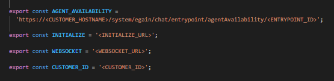

# eGain ServiceDesk Integration Example

This is a functioning service desk integration between Watson Assistant and eGain's Advisor Desktop.

**Important:** This is a reference implementation that provides an example of a fully functional integration. Make any necessary changes and perform robust testing before deploying this integration in production.

This reference implementation supports the core features of an eGain integration. If you want to customize or extend it to add more features, follow the procedure described in the [README](../../../README.md) for this repository.

## Overview

The integration example consists of client-side code that runs in the user's browser and manages the communication between the user and agent. This is an integration of eGain's Advisor Desktop with service desk API that is fully supported by the Watson Assistant web chat integration. (For more information about this API, see [ServiceDesk API](https://github.com/watson-developer-cloud/assistant-web-chat-service-desk-starter/blob/main/docs/API.md)).

## Prerequisites

1. Contact your eGain customer representative to obtain the following:
    - Tenant clientId and clientSecret
    - Customer client app authentication credentials (username and password)
    - Customer client app callback URL
    - Initalizer, Registration and Websocket URLs

2. Configure your eGain Conversation Hub tenant using the steps listed under the section Bring-Your-Own-Channel with eGain Virtual Assistant steps and using this postman script BYOC with eGain VA Conversation API Setup.postman_collection.json from [here](https://ebrain.egain.com/kb/devcentral/content/EASY-8283/Bring-Your-Own-Channel).

3. Once Conversation Hub is configured, please have the below credentials to setup the servicedesk.
    - Customer client app clientId
    - Customer client app clientSecret
    - Channel type
    - Account address
    - Entrypoint Id

## Required setup

1. If you haven't done so already, follow the setup steps in the root-level [README](../../../README.md#development) to make sure you can run an instance of [ExampleServiceDesk](../../example/webChat/README.md).

2. Create a unique customer Id that is in the format of a V4 UUID. We recommend using a simple online generator to create this [here](https://www.uuidgenerator.net/version4).

3. Register the domains you would like to restrict access to when connecting to the servicedesk. The domains should be provided in an array during registration. Wildcard values are supported for hostnames as can be seen in the example below. Any domains not included in this list will not be able to communicate with the servicedesk.

4. Register your webchat integration with eGain.

    - Send an HTTP POST request to the `Registration URL` with the payload format shown below:

      ```
      {
          "customerId": "XXXXXX",
          "clientId": "XXXXXX",
          "clientSecret": "XXXXXX",
          "channelType": "XXXXXX",
          "accountAddress": "XXXXXX",
          "domains": ["localhost:9000", "localhost:*", "egain.com/*"]
      }
      ```

5. In the file `src/egain/webChat/client/eGainConstants.ts`, add the URLs and customer Id as shown below.

    

## Try it out

To start up the client locally in `localhost`, follow these steps:

1. Go to the client directory in [src/egain/webChat/client](./client).

2. From the client directory [src/egain/webChat/client](./client) run:
    - `npm install` to install the dependencies.
    - `npm run dev` to get a development environment running in your browser on port `9000`.

You should now be able to start a web chat session in a browser, and within the web chat, escalate to an agent to trigger the eGain Service Desk integration. For more information about how to start a web chat session using this integration, see the starter kit [README](../../../README.md#development).

## Hosting

To host this integration, choose any of the steps mentioned [here](../../../README.md#custom-integrations-between-web-chat-and-service-desks).

## Supported features

**Start chat with an agent:** The `startChat()` function in [`eGainServiceDesk.ts`](./client/src/eGainServiceDesk.ts) triggers the integration with eGain's Advisor Desktop by creating a chat session.

**End chat:** The chat can be ended by either the user or the agent. This happens when either party leaves or closes the chat session, and when the user refreshes the browser.

**Message exchange:** Both the user and the agent can exchange text messages.

**Typing indicator:** Support for agent typing is implemented.

**Agent availability:** Agent availability has been implemented.
