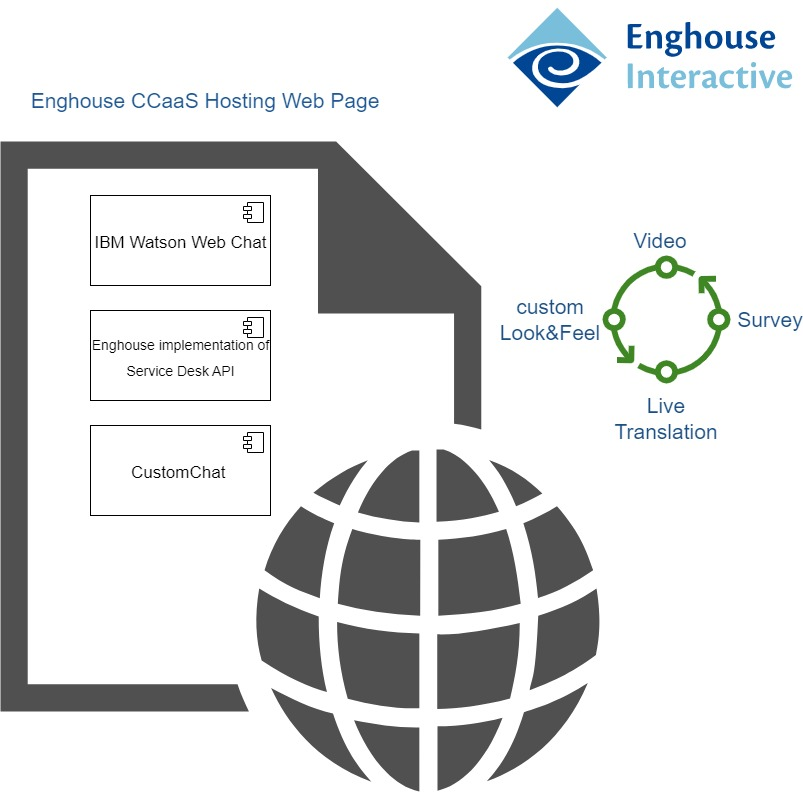

# Enghouse Interactive CCaaS Integration Example

The **Enghouse CCaaS** integration enables integration between IBM Watson Assistant (WA) and Enghouse Interactive (EI) CCaaS tenants' live agents.

## Overview

The integration attempts to make it as simple as possible for Watson Assistance users with EI CCaaS live agents. This integration uses the 3rd party UI provided by the Enghouse EI CustomChat widget.

**Note:** This integration relies on a 3rd party library that is downloaded at runtime by the user's browser. IBM is not responsible for the behavior or maintenance of this library.

### Architecture

The EI CCaaS  integration consists of two main components: hosting web page and backend Contact Center platform . Below is client side component Architecture:



The client-side component manages the communication between the user and the agent. It implements the service desk API that is fully supported by the Watson Assistant web chat integration. (For more information about this API, see [ServiceDesk API](https://github.com/watson-developer-cloud/assistant-web-chat-service-desk-starter/blob/main/docs/API.md)).

The communication uses the EI CustomChat widget component.  This can be referenced using the EI CCaaS default page or a [hosting page](./client/watsonExample.html) can set the `watsonAssistantChatOptions` prior to loading the EnghouseCCaaSWatsonAssistant.js for more advanced features, e.g.:

```
<script>
    function loadWebChat() {
      // Fill in your values for these variables.
      const ccURL = 'https://ccsp.ei.eilabonline.biz/SocialConnectorHelperAPI/api/customchat/getWidgetConfiguration?WidgetId=...';
      const ccName = 'IBM Test Contact Centre';
      const ccAgentIcon = null;

      let webChatInstance;

      // This is the standard web chat configuration object. You should modify these values with the embed code for your
      // own assistant and can modify it further as you need. You can find the documentation for this at
      // https://web-chat.global.assistant.watson.cloud.ibm.com/docs.html?to=api-configuration#configurationobject.
      window.watsonAssistantChatOptions = {
        integrationID: '...',
        region: '...',
        serviceInstanceID: '...',
        subscriptionID: '...',

        serviceDeskFactory: (params) =>
          new window.EnghouseCCaaSWatsonAssistantSD(params.callback, ccName , ccURL, ccAgentIcon, webChatInstance),

        onLoad: async (instance) => {
          webChatInstance = instance;
          instance.render();
        }
      };

      setTimeout(function(){
        const t=document.createElement('script');
        t.src='https://web-chat.global.assistant.watson.appdomain.cloud/versions/' + ((window.watsonAssistantChatOptions && window.watsonAssistantChatOptions.clientVersion) || 'latest') + '/WatsonAssistantChatEntry.js';
        document.head.appendChild(t);
      });
    }
</script>	
<script async src="https://ccsp.ei.eilabonline.biz/PS.CustomChat/EnghouseCCaaSWatsonAssistant.js" onload="loadWebChat()"></script>
```


## Setting Up


The integration utilises the flexible Custom Chat integration to EI CCaaS, the steps for deployment are:


1. Configure Chat routing in EI CCaaS tenant with desired Queue and Skills.
2. Configure CustomChat "widget" and copy its URL used to control the Live Agent interaction specific to your needs, and a "WA" URL to access the WA integration from EI CCaaS.
3. When using the CCaaS integration HTML, the "widget" URL is required to be passed either as the *ccURL* parameter to the "WA" URL, or as a variable in the WA Dialog called *CCURL*.  The "WA" URL must also include parameters to utilise your Assistant's *integrationID*, *region*, and *serviceInstanceID*.  If using your own HTML you can hard-code the required parameters, or obtain the values via some alternative method to suit your preference.
4. By default, the name presented to the contact-centre is the Watson user_id - this display name can be changed in the Flow by setting variables (case of names ignored) as per [Dialog example](./VG_TravelDemo-dialog.json), i.e. 
- firstName - if this is set without lastName, this is the display name
- lastName - if the firstName is also set, the display name is firstName and lastName (with a space between)
- userId - if the firstName is not set this may set the display name


## Example

If the CustomChat "widget" URL was:

`https://{Enghouse CCaaS FQDN}/SocialConnectorHelperAPI/api/customchat/getWidgetConfiguration?WidgetId=<*widgetID*>`

...you would set this to the variable *CCURL* in the Dialog, prior to any likelihood of needing to speak to a Live Agent.


If the Assistant URL provided to you by Enghouse Interactive was:

`https://{Enghouse CCaaS FQDN}/PS.CustomChat`

...you would access your Assistant dialog pass your Assistants' parameters to it (using default EI CCaaS Watson page in this example):

`https://{Enghouse CCaaS FQDN}/PS.CustomChat/indexWatson.html?integrationID=<*integration-ID*>&region=<*region*>&serviceInstanceID=<*service-ID*>`

...or if you preferred not to change an existing Dialog, the "widget" URL may be added as a URL-encoded parameter instead of being set in the dialog:

`https://{Enghouse CCaaS FQDN}/PS.CustomChat/indexWatson.html?integrationID=<*integration-ID*>&region=<*region*>&serviceInstanceID=<*service-ID*>&ccURL=<*widget-URL*>`


## URL options

The complete list of parameters that may be passed to the standard EI CCaaS Watson page URL are:

- *integrationID* - Watson Assistant Integration ID
- *region* - Watson Assistant region
- *serviceInstanceID* - Watson Assistant Instance ID
- *subscriptionID* - Watson Assistant Subscription ID
- *ccName* - the display name of the contact centre, displayed prior to agent answering chat (default is "Contact Centre")
- *ccURL* - the URL-encoded "widget" URL. This may also be set (un-encoded) via the Dialog as the *CCURL* variable (overrides URL if both set). 
- *agentIcon* - the URL-encoded URL of the agent icon (default is an Enghouse Interactive swirl logo).  This may also be set (un-encoded) in the Dialog as the *AgentIcon* variable (overrides URL if both set).

In the likely event of using your own HTML page, the last 3 are parameters you may pass to the `EnghouseCCaaSWatsonAssistantSD` ServiceDesk obtained via your preferred means.

## Demo


## Known limitations and issues


The chat is performed using the Enghouse CCaaS CustomChat widget interface as a custom panel in Watson - Watson only has the mechanism to allow the Service Desk to notify what agents have typed and not what callers have typed (as it expects to be telling the Service Desk this, and not vice-versa), therefore Enghouse CCaaS integration sends both sides of the conversation as if from the agent to ensure a full transcript is available in Watson. Visually this is handled by prefixing the agent's text with their name and the caller's text with "You", however screen readers will likely perceive all text to be from the agent.
