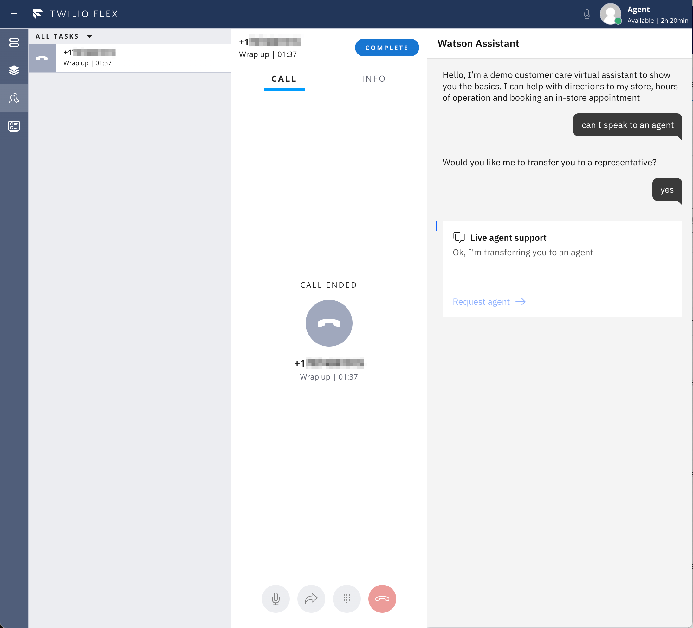

# Twilio Flex Watson Assistant Agent App

This is a functioning agent app integration between Watson Assistant and Twilio Flex.

**Important:**  This is a reference implementation that provides an example of a fully functional integration. Make any necessary changes and perform robust testing before deploying this integration in production.

## Overview

This integration provides agents in Twilio Flex with a transcript of the conversation between the end user and Watson Assistant. To learn more about transferring between end users and agents in Twilio Flex please see:
- [Twilio Flex Service Desk for WebChat](../webChat/)
- [Twilio Flex Service Desk for Phone](https://cloud.ibm.com/docs/assistant?topic=assistant-deploy-phone-flex)

This project was built using the [Flex Plugin Builder](https://github.com/twilio/flex-plugin-builder). To learn more about developing plugins for your Twilio Flex dashboard, refer to the [getting started guide](https://www.twilio.com/docs/flex/quickstart/getting-started-plugin).


## Setting Up

Make sure you have [Node.js](https://nodejs.org) as well as [`npm`](https://npmjs.com) installed. 
Additionally, install the [Flex Plugins CLI](https://www.twilio.com/docs/flex/developer/plugins/cli/install).

1. Clone the parent repository. 
```
git clone https://github.com/watson-developer-cloud/assistant-web-chat-service-desk-starter.git
```

2. Change directory and install dependencies
```bash
cd src/flex/agentApp
npm ci
```

## Deploy and Release Plugin

To deploy your plugin, open a terminal and run the following command:
```bash
twilio flex:plugins:deploy --major --changelog "Adds the Watson Assistant Agent App" --description "Enables the service desk agent to get a quick view of the conversation history between the visitor and Watson Assistant."
```
This command will upload the plugin to Twilio Flex, but it is not enabled for all users until it is released. You can release the plugin by executing this command:

```bash
twilio flex:plugins:release --name "Plugin Release - Watson Assistant Agent App" --description "Enabling plugin Watson Assistant Agent App" --plugin plugin-watson-assistant-agent-app@latest
```
For more details on deploying your plugin, refer to the [deploying your plugin guide](https://www.twilio.com/docs/flex/developer/plugins/cli/deploy-and-release).


## Viewing the conversational history between an agent and the assistant

On the [Twilio Flex - Agent Desktop](https://flex.twilio.com/agent-desktop/). After receiving the request, the agent can then view the conversation history from the agent desktop during the call with the end user.

<p align="center">

</p>


