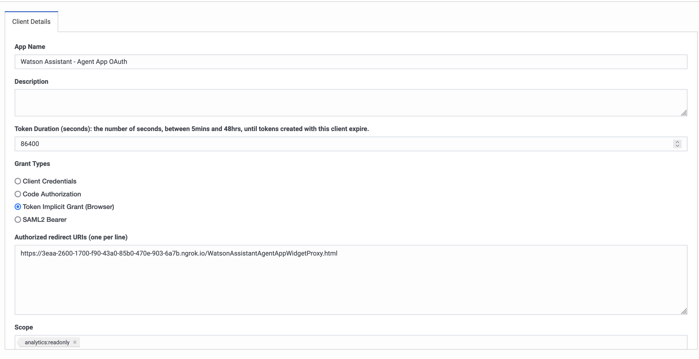
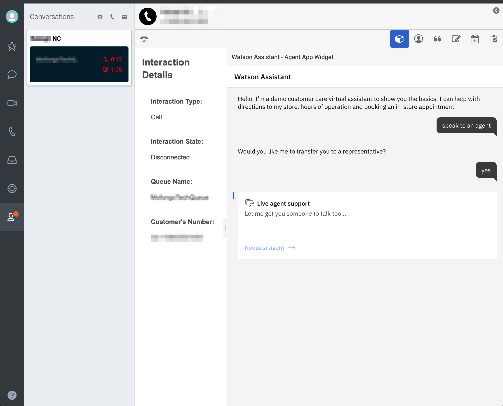

# Genesys PureCloud Watson Assistant Agent App

This is a functioning Agent App integration between Watson Assistant and Genesys PureCloud.

**Important:**  This is a reference implementation that provides an example of a fully functional integration. Make any necessary changes and perform robust testing before deploying this integration in production.

## Overview

This integration provides agents in Genesys PureCloud with a transcript of the conversation between the end user and Watson Assistant. To learn more about transferring between end users and agents in Genesys PureCloud, please see:
- [Genesys Service Desk for WebChat](../webChat/)
- [Genesys Service Desk for Phone](https://cloud.ibm.com/docs/assistant?topic=assistant-deploy-phone-genesys)

## Setting up

End users must be able to access the files from their browsers. Host the files located in the directory (`public/WatsonAssistantAgentAppWidgetProxy.html` and `public/js/WatsonAssistantAgentAppWidgetProxy.js`) in a server that is reachable by your end users. If you do not have your own hosted environment, and you wish to expose your local development for end-user testing, consider using a service such as [ngrok](https://ngrok.com/) to create a public URL.
To start up a server in `localhost`, follow these steps:

1. From the `src/genesys/agentApp/`directory run: `npm install`.

1. Start a static server to host the files locally by running `npm start`. This hosts the files on `http://localhost:9000`.

1. Optional: If you are using `ngrok`, run this command to expose the static server:
    ```bash
    ngrok http http://localhost:9000
    ```


## Authentication

1. Follow the steps to create an [OAuth Client for Genesys](https://help.mypurecloud.com/articles/create-an-oauth-client/). When choosing the **Grant Type**, choose **Implicit Grant (Browser)**.
    - For **App Name**, you can specify any name for the application (for example, `Watson Assistant - Agent App OAuth`).
    - In the **Authorized Redirect URI(s)** field, specify the URL where you will be hosting the Agent Application. If you're using `ngrok`, specify the URL in the following format:
    ```
    https://<some-hash>.grok.io/WatsonAssistantAgentAppWidgetProxy.html
    ``` 
<p align="center">

</p>

2. After the OAuth client is created, scroll down to the bottom of the OAuth client page and copy the **Client ID** value.

3. Go to the [public/js/WatsonAssistantAgentAppWidgetProxy.js](public/js/WatsonAssistantAgentAppWidgetProxy.js#15) file and specify the **Client ID**
    ```javascript
    const GENESYS_CLIENT_ID = '<GENESYS_OAUTH_CLIENT_ID>';
    ```


## Create a Genesys Integration Widget

1. Follow the steps to create an [Interaction Widget for Genesys](https://help.mypurecloud.com/articles/set-up-an-interaction-widget-integration/). 
    - Under the **Configuration** tab, in the **Application URL** field, specify your application URL with these query parameters:
        ```
        https://app.example.com/WatsonAssistantAgentAppWidgetProxy.html?pcConversationId={{pcConversationId}}&pcLangTag={{pcLangTag}}&pcEnvironment={{pcEnvironment}}
        ```
    If you're using `ngrok`, specify the URL from the ngrok command, as in the following example:
        ```
        https://<some-hash>.ngrok.io/WatsonAssistantAgentAppWidgetProxy.html?pcConversationId={{pcConversationId}}&pcLangTag={{pcLangTag}}&pcEnvironment={{pcEnvironment}}
        ```


## Viewing the Conversational History between an agent and the bot

To receive requests, make sure you have clicked the **On Queue** button in the Genesys UI. If you've linked everything to your Genesys Cloud account correctly, you should be able to connect to an agent in Genesys Cloud. After receiving the request, the agent can then access the widget from the agent desktop:




