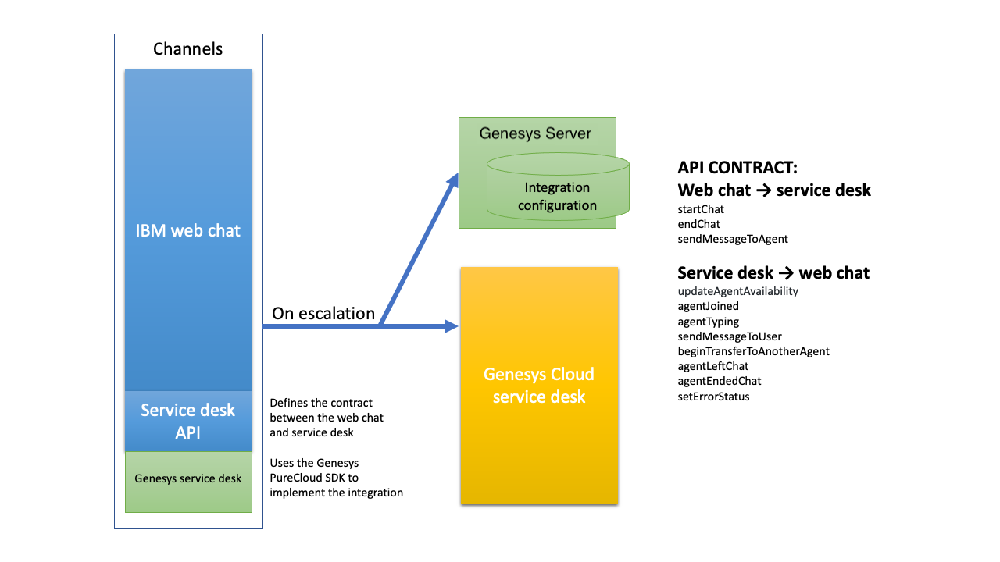

# Genesys Cloud Integration Usage Example

This is a functioning service desk integration between Watson Assistant and Genesys Cloud.

**Important:**  This is a reference implementation that provides an example of a fully functional integration. Make any necessary changes and perform robust testing before deploying this integration in production.

This reference implementation supports the core features of a Genesys Cloud integration. If you want to customize or extend it to add more features, follow the procedure described in the [README](../../../README.md) for this repository.

  You can refer to these Genesys docs and resources for more information about using the Genesys PureCloud API:

  - [Guest Chat Client - JavaScript](https://developer.mypurecloud.com/api/rest/client-libraries/javascript-guest/index.html)
  - [Guest Chat APIs](https://developer.mypurecloud.com/api/webchat/guestchat.html)
  - [Guest Chat Client API documentation](https://developer.mypurecloud.com/api/rest/client-libraries/javascript-guest/WebChatApi.html)
  - [Guest Chat Client API source code](https://github.com/MyPureCloud/purecloud-guest-chat-client-javascript/blob/9599e33609a87358671532b10e53fad24e592373/build/src/purecloud-guest-chat-client/api/WebChatApi.js)

## Overview

The Genesys Cloud integration consists of two main components: client-side code that runs in the user's browser, and server-side code that you host.



The client-side component manages the communication between the user and the agent. It implements the service desk API that is fully supported by the Watson Assistant web chat integration. (For more information about this API, see [ServiceDesk API](https://github.com/watson-developer-cloud/assistant-web-chat-service-desk-starter/blob/main/docs/API.md)).

The communication uses the Genesys guest chat SDK, which can be found at [Guest Chat Client - JavaScript](https://developer.mypurecloud.com/api/rest/client-libraries/javascript-guest/index.html). This SDK is based on WebSocket, which enables two-way communication. For some advanced functions, the integration also uses the Genesys [REST API](https://developer.mypurecloud.com.au/api/rest/v2/).

## Setting Up

1. If you haven't done so already, follow the setup steps in the root-level [README](../../../README.md#development) to make sure you can run an instance of [ExampleServiceDesk](../../serviceDesks/exampleServiceDesk.ts).

1. In Genesys Cloud, [create a widget](https://help.mypurecloud.com/articles/create-a-widget-for-web-chat/) to enable users to chat with agents. Make a note of the generated deployment key. Follow the instructions for either a `1.1` or `1.0` widget.

1. Make sure there is an active queue by selecting your profile bubble on the left sidebar and clicking on **Activate Queues**. Check that there is at least one queue under **Active**. If not, either activate a queue under **Available**, or [create a queue](https://help.mypurecloud.com/articles/create-queues/). In any case, take note of the name of the active queue you would like to use.
    - **Creating a queue:**
      - The queue name must not include any spaces. This queue name should be unique, and should describe the purpose or grouping of the queue. Make sure you click **Save**.
      - Click on the queue that you just created and add yourself through the **Members** tab (you do not have to click **Save**).
      - Any newly created queues will be active by default.

1. Set up middleware server:

    1. In the `src/genesys/webChat/server` subdirectory, rename or copy `.env-sample` to `.env`.

    1. In the `.env` file, update:
        - `ORGANIZATION_ID`: Your Genesys Cloud organization ID. This ID is visible in your widget configuration page in the `Generated Script Tag` block's `org-guid` field.  You can also find this ID in the [Genesys Cloud settings](https://help.mypurecloud.com/faq/how-do-i-find-my-organization-id/).
        - `DEPLOYMENT_ID`: The deployment key of the widget you created in the previous steps.
        - `QUEUE_TARGET`: The name of your active queue, noted from the previous steps.

    1. (Optional) Set up advanced features (agent availability and authenticated chat).

        1. If you haven't done so already, [set up a Genesys Cloud OAuth client](https://help.mypurecloud.com/articles/create-an-oauth-client/).

        1. In the `.env` file, update with your credentials:
            - `GENESYS_CLIENT_ID`: Your client ID from the Genesys Cloud OAuth client created above.
            - `GENESYS_CLIENT_SECRET`: Your client secret from the Genesys Cloud OAuth client created above.

    1. From the `src/genesys/webChat/server` directory, run `npm install`.

    1. From the `src/genesys/webChat/server` directory, run `npm start`. This starts a server on port 3000 on your local machine.

    1. Your end users must be able to access the server from their browsers. If you do not have your own hosted environment, and you wish to expose your local development for testing, consider using a service such as [ngrok](https://ngrok.com/) to create a public URL:

        ```
        ngrok http http://localhost:3000
        ```

1. Go to the client directory in [src/genesys/webChat/client](../client). Rename or copy `.env-sample` to `.env`. In the `.env` file:
      - Add `SERVER_BASE_URL` variable to where your middleware is deployed (For local development, if you used `ngrok` to create your public URL, this looks like `https://<some-hash>.ngrok.io`).

        **Note**: Make sure you specify the secure `https://` URL.

      - If you chose to set up an OAuth client in the middleware server instructions above, and want to enable advanced features:

        - For **Agent Availability**
            1. In [`genesysServiceDesk.ts`](../client/src/genesysServiceDesk.ts), set `OAUTH_API_CALLS_ENABLED` to `true`.

        - For **JWT Authenticated Chat**
            1. In the Genesys Cloud UI, open the settings for your web chat widget and enable **Require Authentication**.

            1. In the **Authentication URL** field, specify `https://<server-url>/jwt`, where `<server-url>` is the public URL for your middleware server. Click **Save**.

            1. In [`genesysServiceDesk.ts`](../client/src/genesysServiceDesk.ts), make sure to set the `AUTHENTICATED_CHAT_ENABLED` flag to `true`.

1. From the Genesys webchat client directory [src/genesys/webChat/client](../client), run:
    - `npm run install`
    - `npm run dev`

    To receive requests, make sure you have clicked the **On Queue** button in the Genesys UI. If you've linked everything to your Genesys Cloud account correctly, you should be able to connect to an agent in Genesys Cloud.

**Implementation Notes:**

There are two flags in [`genesysServiceDesk.ts`](../client/src/genesysServiceDesk.ts) that control advanced features such as agent availability and authenticated chat.
- `OAUTH_API_CALLS_ENABLED`: Default is `false`. When set to `true`, any Genesys API calls that require OAuth tokens for authentication will be enabled. Currently, only agent availability uses this flag.
- `AUTHENTICATED_CHAT_ENABLED`: Default is `false`. When set to `true`, JWT tokens will be used to authenticate chat users.