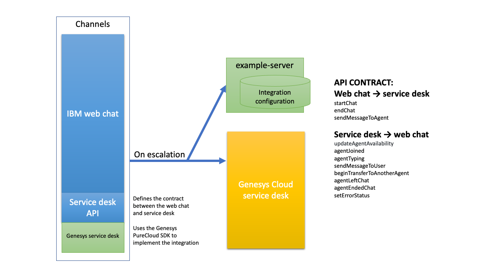

# Genesys Cloud integration example

This is a functioning service desk integration between Watson Assistant and Genesys Cloud. This is a reference implementation that provides a fully functional integration.

**Important:** You should perform robust testing before deploying this integration in production.

This reference implementation supports the core features of a Genesys Cloud integration. If you want to customize or extend it to add more features, follow the procedure described in the [README](../../../README.md) for this repository.

    You can refer to these Genesys docs and resources for more information about using the Genesys PureCloud API:

      - [Guest Chat Client - JavaScript](https://developer.mypurecloud.com/api/rest/client-libraries/javascript-guest/index.html)

      - [Guest Chat APIs](https://developer.mypurecloud.com/api/webchat/guestchat.html)

      - [Guest Chat Client API documentation](https://developer.mypurecloud.com/api/rest/client-libraries/javascript-guest/WebChatApi.html)

      - [Guest Chat Client API source code](https://github.com/MyPureCloud/purecloud-guest-chat-client-javascript/blob/9599e33609a87358671532b10e53fad24e592373/build/src/purecloud-guest-chat-client/api/WebChatApi.js)

## Overview

The Genesys Cloud integration consists of two main components: client-side code that runs in the user's browser, and server-side code that you host.



The client-side component manages the communication between the user and the agent. It implements the service desk API that is fully supported by the Watson Assistant web chat integration. (For more information about this API, see [ServiceDesk API](https://github.com/watson-developer-cloud/assistant-web-chat-service-desk-starter/blob/main/docs/API.md)).

The communication uses the Genesys guest chat SDK, which can be found at [Guest Chat Client - JavaScript](https://developer.mypurecloud.com/api/rest/client-libraries/javascript-guest/index.html). This SDK is based on WebSocket, which enables two-way communication. For some advanced functions, the integration also uses the Genesys [REST API](https://developer.mypurecloud.com.au/api/rest/v2/).

## Setting up

1. If you haven't done so already, follow the setup steps in the root-level [README](../../../README.md) to make sure you can run an instance of [ExampleServiceDesk](../../serviceDesks/exampleServiceDesk.ts).

1. In Genesys Cloud, [create a widget](https://help.mypurecloud.com/articles/create-a-widget-for-web-chat/) to enable users to chat with agents. Make a note of the widget ID.

1. Update [`purecloudSetup.ts`](../../serviceDesks/genesys/purecloudSetup.ts) to populate it with your information.
    - `ORGANIZATION_ID`: Your Genesys Cloud organization ID. You can find this ID in the [Genesys Cloud settings](https://help.mypurecloud.com/faq/how-do-i-find-my-organization-id/).
    - `DEPLOYMENT_ID`: The ID of the widget you created in the previous step.

1. Go to the project root directory and edit the `.env` file. Update the `SERVICE_DESK_CLASS` variable to `GenesysServiceDesk`.

1. From the project root directory, run `npm run dev`. If you've linked everything to your Genesys Cloud account correctly, you should be able to connect to an agent in Genesys Cloud.

To configure advanced functionality such as authenticated chat and agent availability status, follow these steps:

1. If you haven't done so already, [set up a Genesys Cloud OAuth client](https://help.mypurecloud.com/articles/create-an-oauth-client/).

1. In the `example-server` subdirectory, rename or copy `.env-sample` to `.env`.

1. In the `.env` file, update the values of the `GENESYS_CLIENT_ID` and `GENESYS_CLIENT_SECRET` to the credentials from your Genesys OAuth client.

1. From the `example-server` directory, run `npm i`.

1. From the `example-server` directory, run `npm start`. This starts a server on port 3000 of your local machine.

1. The server needs to be accessed from the browser of your end users. If you do not have your own hosted environment and you wish to expose your local development for testing, consider using a service such as [ngrok](https://ngrok.com/) to create a public URL:

    ```
    ngrok http http://localhost:3000`
    ```

1. In [`purecloudSetup.ts`](../../serviceDesks/genesys/purecloudSetup.ts), set the value of `AUTH_SERVER_BASE_URL` to the public URL for your server. Make sure you specify the `https://` URL.

1. In the Genesys Cloud user interface, open the settings for your web chat widget and enable **Require Authentication**.

1. In the **Authentication URL** field, specify `https://<server-url>/jwt`, where `<server-url>` is the public URL for your server. Click **Save**.

1. In [`genesysServiceDesk.ts`](../../serviceDesks/genesys/genesysServiceDesk.ts), set the `WIDGET_REQUIRES_AUTHENTICATION` and `AUTHENTICATED_CALLS_ENABLED` flags to `true`.

    **Note:** These flags are independent, so you do not have to enable both simultaneously. For example, if you set `WIDGET_REQUIRES_AUTHENTICATION = false` and `AUTHENTICATED_CALLS_ENABLED = true`, authentication willl be disabled in the web chat widget, but the server will still use an OAuth token to authenticate when accessing agent availability status.

1. From the project root directory, run `npm run dev` again, and test. The server should now authenticate the chat and fetch agent availability.
